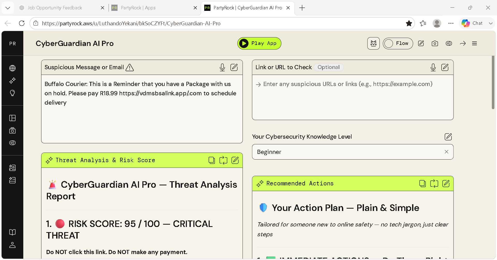
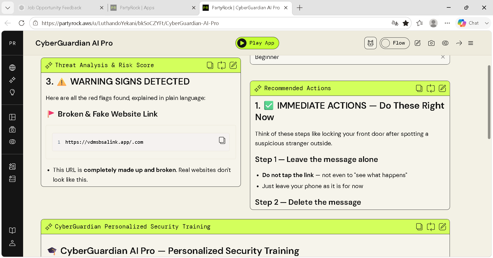
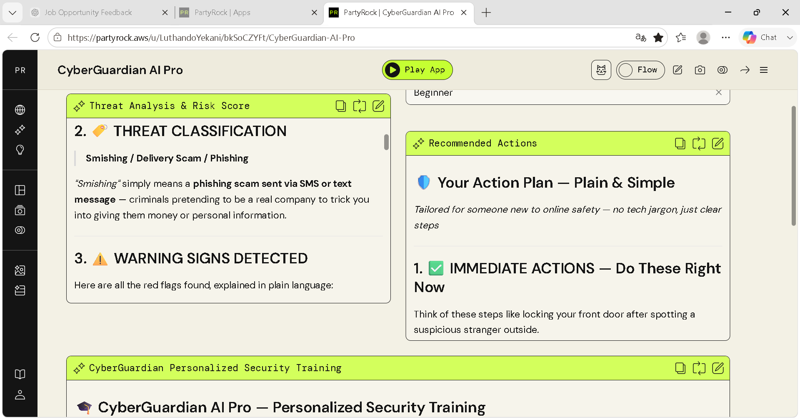
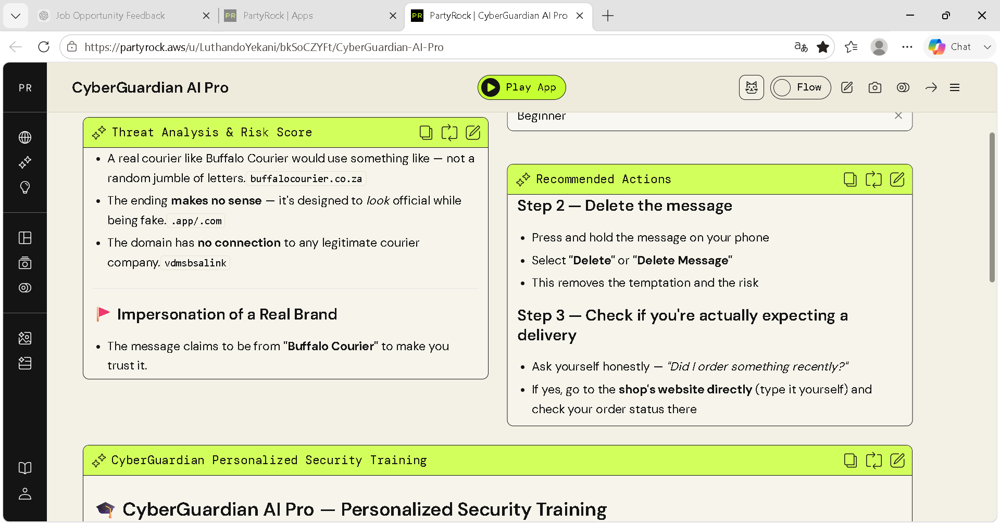
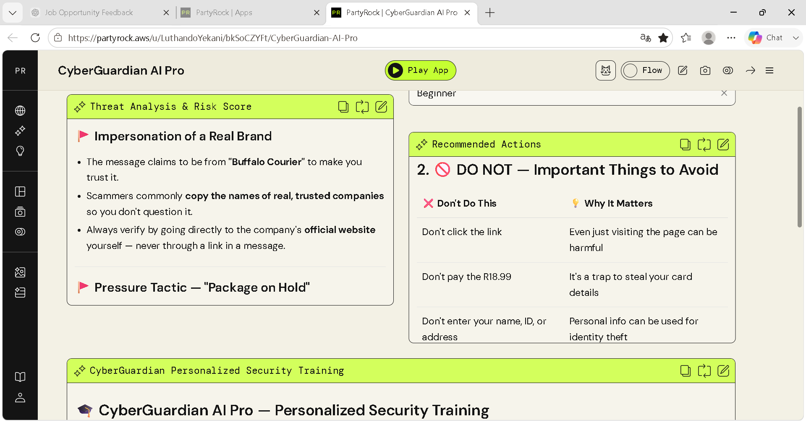
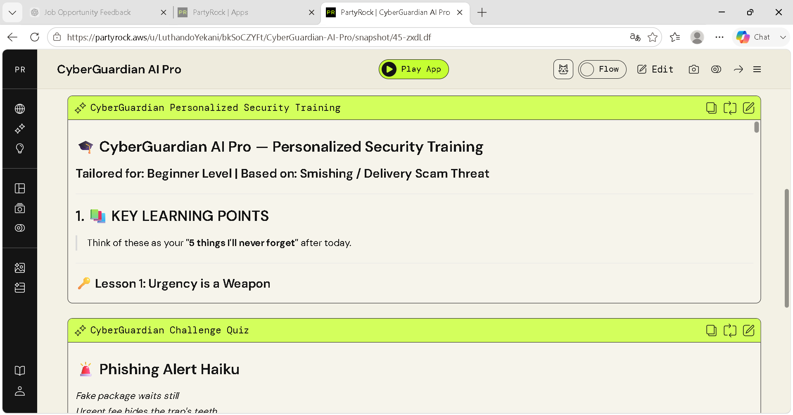
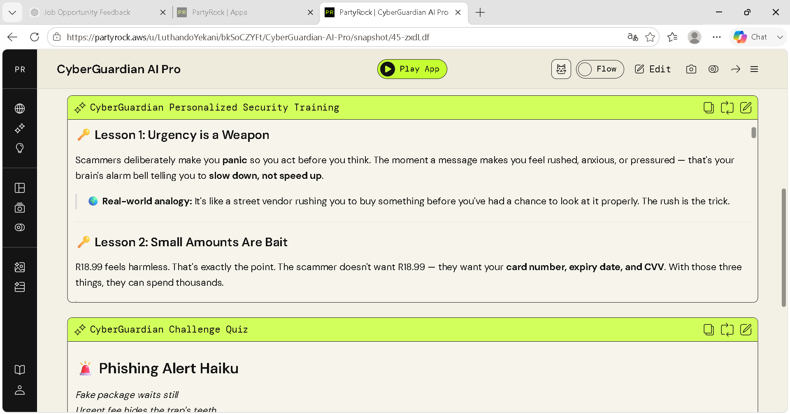
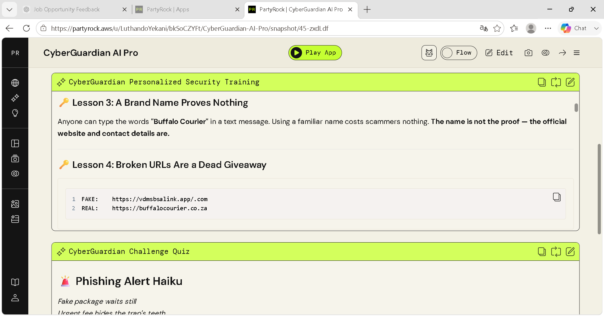
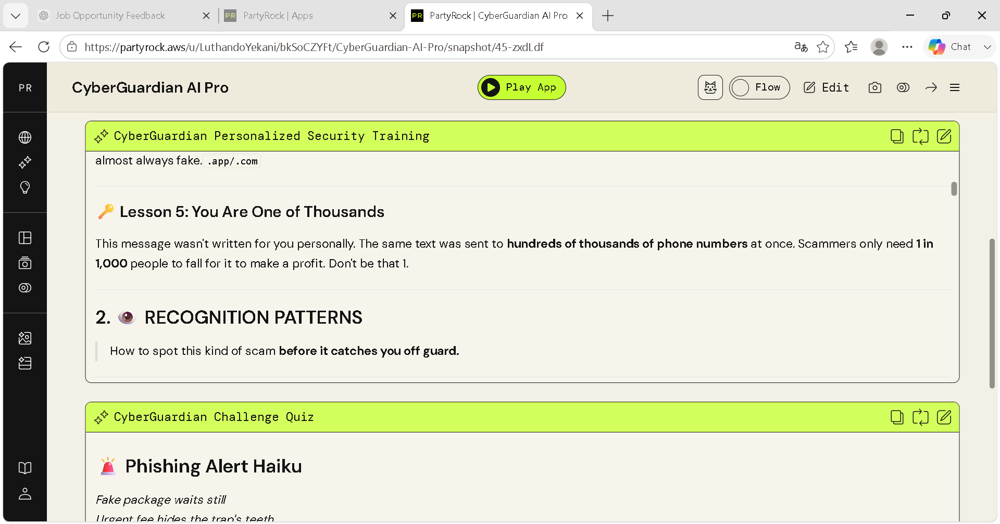
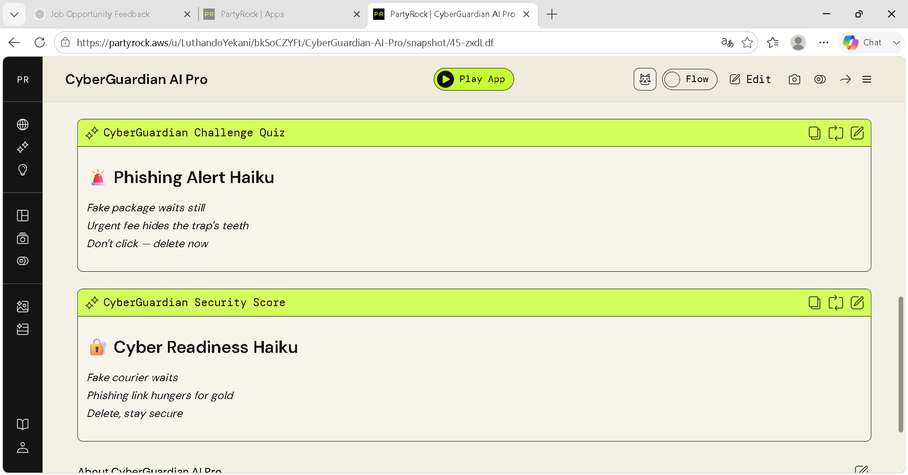

# 🛡️ CyberGuardian AI Pro

> **AI-Powered Phishing Analysis & Cybersecurity Awareness Platform built with AWS PartyRock**

CyberGuardian AI Pro is a generative AI application developed using **AWS PartyRock** that helps users identify phishing attacks, analyze suspicious messages and URLs, understand cybersecurity risks, and receive personalized security awareness training.

Unlike a traditional chatbot, CyberGuardian AI Pro combines **threat detection, risk assessment, security education, and user guidance** into a single interactive experience.

---

## 🎯 Project Objectives

The application was designed to:

- Detect phishing and social engineering attacks
- Analyse suspicious SMS messages, emails and URLs
- Generate an AI-powered threat assessment
- Explain cybersecurity concepts in plain language
- Provide personalised security awareness training
- Improve users' ability to recognise future attacks

---

# 🚀 Key Features

✅ AI-powered phishing detection

✅ Threat risk scoring (0–100)

✅ Threat classification

✅ Suspicious URL analysis

✅ Plain-language explanations

✅ Beginner-friendly recommendations

✅ Personalised cybersecurity training

✅ Interactive learning content

---

# 🏗 Technology Stack

| Technology | Purpose |
|------------|---------|
| AWS PartyRock | AI application development |
| Amazon Bedrock | Foundation Models |
| Generative AI | Threat analysis |
| Prompt Engineering | AI behaviour design |

---

# 📸 Application Walkthrough

## Home Interface

Users can submit:

- Suspicious SMS messages
- Emails
- URLs
- Website links

The application also allows users to select their cybersecurity knowledge level so responses are tailored to beginners and non-technical users.

---

## AI Threat Analysis

CyberGuardian AI Pro analyses the submitted content and generates:

- Overall Risk Score
- Threat Severity
- Threat Classification
- Executive Summary

Rather than simply flagging content as "phishing", the AI explains **why** it reached its conclusion.

---

## Threat Classification

The application classifies the attack type, including:

- Phishing
- Smishing
- Delivery scams
- Social engineering
- Brand impersonation

Each threat is explained using simple language suitable for non-technical users.

---

## Threat Indicators

CyberGuardian AI Pro identifies suspicious indicators including:

- Fake domains
- Broken URLs
- Brand impersonation
- Urgency tactics
- Suspicious payment requests

Every indicator is explained so users understand the attacker's strategy.

---

## Recommended Actions

After identifying the threat, the application generates a practical response plan, including:

- Immediate actions
- Things to avoid
- Safe verification methods
- Recovery guidance

Recommendations are tailored to the user's cybersecurity knowledge level.

---

## Personalised Security Training

One of the application's strongest features is its built-in cybersecurity awareness training.

Instead of ending after the analysis, CyberGuardian AI Pro teaches users:

- Why the scam works
- How attackers manipulate victims
- What warning signs to remember
- How to recognise similar attacks in the future

---

## Security Awareness Lessons

Educational content includes topics such as:

- Urgency as a social engineering tactic
- Brand impersonation
- Suspicious URLs
- Psychological manipulation
- Scam recognition patterns

This transforms every phishing analysis into a practical learning opportunity.

---

## Cybersecurity Awareness

The application reinforces learning by helping users recognise common phishing patterns before they become victims.

The goal is not only to detect attacks, but to improve long-term cybersecurity awareness.

---

## Interactive Learning

To reinforce learning, CyberGuardian AI Pro generates interactive educational content including:

- Cybersecurity summaries
- Memory aids
- Security quizzes
- Phishing awareness exercises

---

## Cyber Readiness

The application concludes with memorable cybersecurity messages that encourage users to remain vigilant against future phishing attempts.

---

# 🧠 Skills Demonstrated

This project demonstrates practical experience in:

- AWS PartyRock
- Amazon Bedrock
- Prompt Engineering
- Generative AI
- AI Application Development
- Cybersecurity Awareness
- Phishing Detection
- Security Education
- Technical Documentation
- User Experience Design

---

# 💡 Lessons Learned

Building CyberGuardian AI Pro provided valuable experience in:

- Designing AI-powered applications without traditional coding
- Structuring effective prompts for consistent AI responses
- Creating user-focused cybersecurity solutions
- Explaining complex technical concepts in plain language
- Combining AI analysis with educational content

---

# 🔮 Future Improvements

Planned enhancements include:

- OCR support for screenshot analysis
- Email header analysis
- Attachment inspection
- Multi-language support
- Additional phishing scenarios
- Threat intelligence integration

---

# 📄 Live Application

The application link is available in **app-link.md**

---

# 📜 License

This project is licensed under the MIT License.
